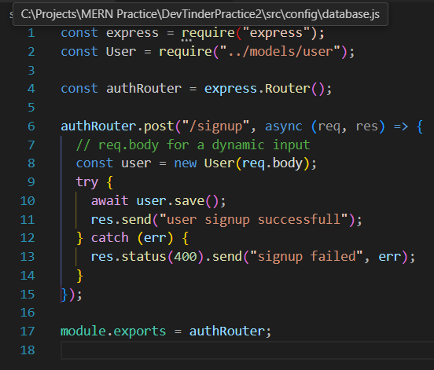
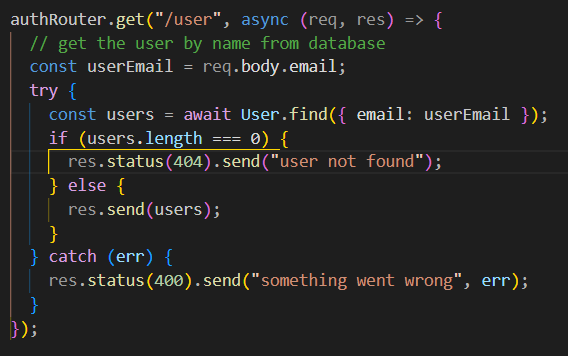
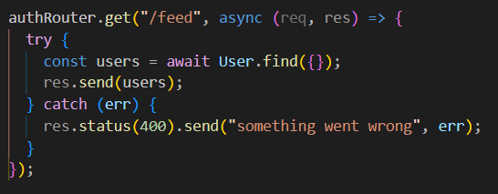
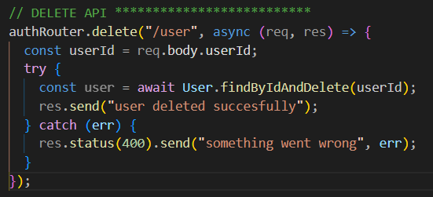
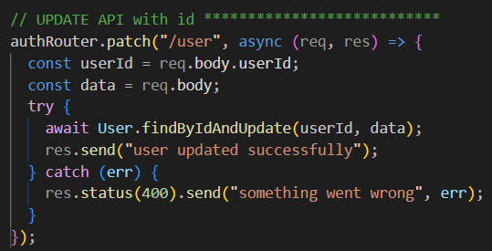
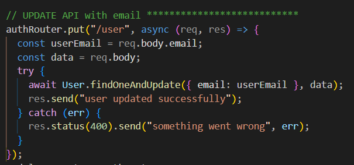

# Writing API

# SETUP

- Create routes folder > user.js file
- Import express
- Import models(Schemas)
- Import Router (const authRouter = express.Router();)
- Export Router (module.exports = authRouter;)

# SIGNUP API

- create a POST signup router
- to take a dynamic inputs we will
- Will now create a new instance of User model
- Declare a user, then new User (Models)
- With the req.body we will be able to take input of all models feild we created
- we will save the user (user.save())
- after signup will send a response res.send("....")
- 

# FIND USER BY EMAIL

- Create a GET user API route
- declare a const userEmail to store email from req.body.email
- with the help of find method pass {email:userEmail}
- 
-

# FEED API

- Create a GET feed API route
- Just use the find method and pass empty object {}
- 

# DELETE API

- 

# UPDATE API with id

- 

# UPDATE API with email

- 
