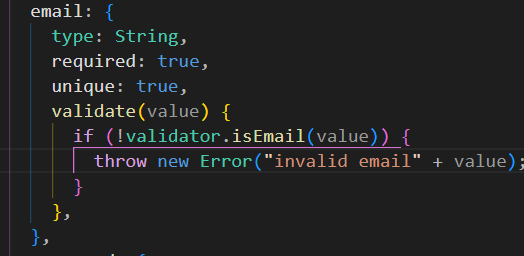
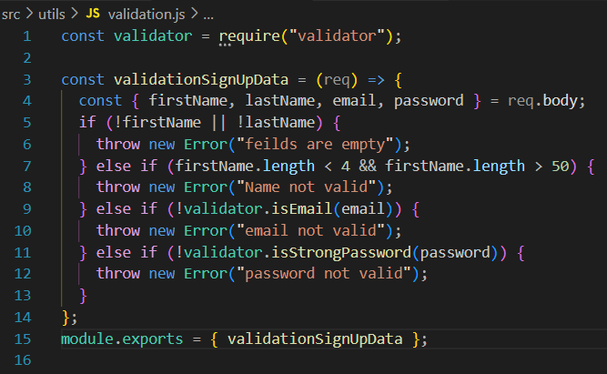
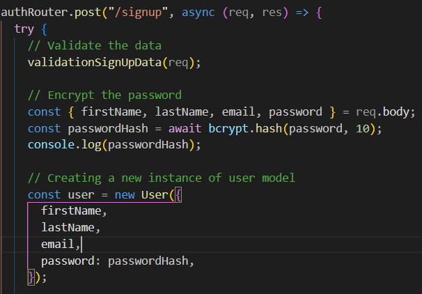
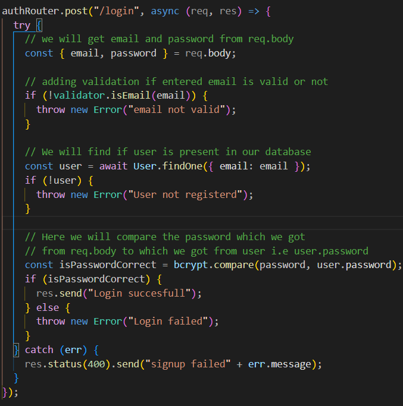

# Writing API

# SETUP

- Create routes folder > user.js file
- Import express
- Import models(Schemas)
- Import Router (const authRouter = express.Router();)
- Export Router (module.exports = authRouter;)

# SIGNUP API

- create a POST signup router
- to take a dynamic inputs we will
- Will now create a new instance of User model
- Declare a user, then new User (Models)
- With the req.body we will be able to take input of all models feild we created
- we will save the user (user.save())
- after signup will send a response res.send("....")
- 

# FIND USER BY EMAIL

- Create a GET user API route
- declare a const userEmail to store email from req.body.email
- with the help of find method pass {email:userEmail}
- 
-

# FEED API

- Create a GET feed API route
- Just use the find method and pass empty object {}
- 

# DELETE API

- 

# UPDATE API with id

- 

# UPDATE API with email

- 

# VALIDATION ON SCHEMAS

- Make some feild mandatory with required:true (eg.firstName,email,password..etc)
- With same email there should not be 2 user, using unique:true
- default value, string etc explore all the documentation

- 

- VALIDATE method ,if in gender only value includes male female then write following code in gender schema
- 
- Works only when new instance is created
- if we want to work this on while updating in patch api we should add{ runvalidator:true} parameter

# SANITIZING API

# UPDATE API

- we will validate feild which should be updated
- to validate feild we will retrict req.body to which data should come for updates
- the following code to validate api
- 

# Validator external library

- install validator > import in model file
- write in validate paramater
- 

# Adding Validation in Signup API

- If the data is not valid we will not let the user to register to database
- for a validation of API we will write function to another folder > file
- Create a utils folder > validation file
- Follow the following code
- 

# ENCRYPYING PASSWORD

- Install package bycrypt

- 

# LOGIN API

- Create login api
- we will get email and password from req.body
- adding validation if entered email is valid or not
- We will find if user is present in our database in User model with help of findOne method
- Here we will compare the password which we got from req.body to which we got from user i.e user.password

- 
